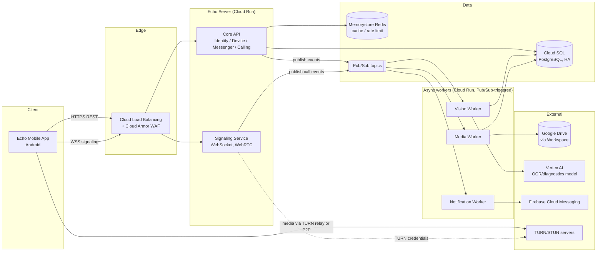
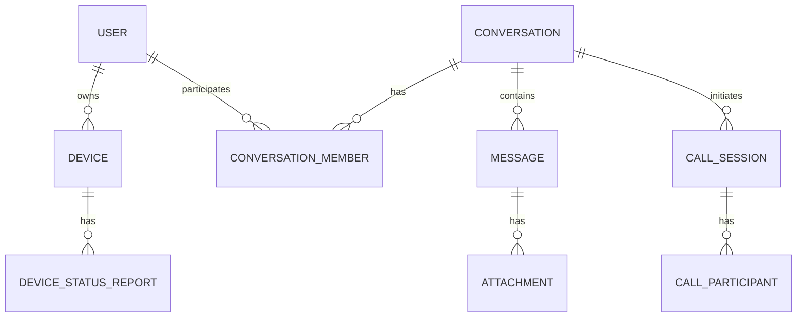

# Corvid Echo — High-Level Design

**Status:** Draft v0.1 — for review
**Source requirements:** `Corvid Echo Project.pdf` (Corvid Systems)
**Target scale:** Small pilot (hundreds–low thousands of devices/users), production-hardened with a documented path to mid/large scale
**Target platform:** Google Cloud Platform (GCP)

---

## 1. Purpose & Scope

Corvid Echo enhances field technical support with three capabilities, delivered via an Android app and a backend platform:

1. **Vision** — a technician photographs a device's LCD display; the system extracts the Device ID, sensor readings (e.g. level, temperature, pressure), and diagnostic icon states (SIM presence, signal strength, power source) and records them as a structured Device Status Report against the photo.
2. **Messenger** — 1:1 and group text chat with file sharing (images/video/documents), so a technician can escalate to a support agent.
3. **Audio/Video calling** — WebRTC-based calls initiated from within the Messenger.
4. **User management** — CRUD for user accounts and roles.

This document defines the target architecture for a production deployment, not the original internship-scope prototype. It assumes some requirements (deployment platform, scale, specific NFR targets) per decisions made with the project owner; see §9 for assumptions and open items.

**Out of scope for v1:** multi-tenant SaaS support, multi-region active-active, group video calls (only 1:1 video in scope; group voice/video noted as future work).

---

## 2. Functional Requirements Summary

| Area | Capability |
|---|---|
| Vision | Submit device photo → async OCR/diagnostics extraction → structured report + original photo retained |
| Device | Device registry (CRUD), Device Status Report history per device |
| Messenger | 1:1 & group conversations, text messages, file attachments (image/video/document), delivery/read status |
| Calling | WebRTC 1:1 audio/video calls, initiated from a conversation |
| User | User CRUD, authentication, role-based access (end user / support agent / admin) |
| Notifications | Push notification on new message, call, and status-report result |

---

## 3. Architecture Overview

### 3.1 Style

A **modular monolith** on Spring Boot, decomposed internally into the same bounded contexts a future microservices split would use. This is deliberate for pilot scale: it minimizes operational overhead (one deployable to monitor, deploy, and secure) while keeping module boundaries clean enough to extract a service later without a rewrite. The Vision pipeline and Media adapter are split out as separate deployables from day one, because they have distinctly different scaling/failure characteristics from the core API (see §3.3 and §6).

### 3.2 Bounded contexts (modules)

- **Identity** — authn/authz, user CRUD, roles
- **Device** — device registry, status report ingestion, report history
- **Messenger** — conversations, groups, messages, attachments
- **Calling** — WebRTC signaling, call session lifecycle, TURN credential issuance
- **Media** — abstraction over Google Drive (upload/download/permission), independent of Vision/Messenger callers
- **Vision** — async worker: photo → OCR/diagnostics extraction → structured report
- **Notification** — push notification fan-out (FCM)

### 3.3 Component diagram

### 3.4 Key flows (narrative)

- **Status report:** App uploads photo → Core API stores metadata + enqueues Pub/Sub event → Vision Worker pulls photo from Media, calls Vertex AI model, writes structured `DeviceStatusReport`, publishes a "report ready" event → Notification Worker pushes to the user.
- **Messenger attachment:** App requests an upload slot → Core API issues a signed reference → Media Worker uploads bytes to Drive, confirms, message becomes visible to recipients.
- **Call:** App opens a signaling WebSocket to the Signaling Service → offer/answer/ICE candidates relayed → app exchanges media P2P where possible, falling back to TURN relay.

---

## 4. Technology Stack → GCP Mapping

| Layer | Technology | GCP Service |
|---|---|---|
| Compute (API + signaling) | Java 26, Spring Boot | Cloud Run (min instances ≥2 per service, autoscaling) |
| Compute (async workers) | Spring Boot | Cloud Run, Pub/Sub push subscriptions |
| Database | PostgreSQL | Cloud SQL for PostgreSQL, regional HA, automated backups + PITR |
| Cache / rate limiting | Redis | Memorystore for Redis |
| Async messaging | — | Pub/Sub (+ dead-letter topics) |
| Media storage | Google Drive (per requirement) | Drive API via Corvid Google Workspace domain-wide delegation |
| Vision/OCR model | Custom or managed model | Vertex AI |
| Auth | OIDC | Identity Platform (Firebase Auth) issuing JWTs |
| Secrets | — | Secret Manager |
| Networking | — | VPC, Private Service Connect to Cloud SQL/Memorystore, Cloud Armor, Cloud Load Balancing |
| Push notifications | — | Firebase Cloud Messaging |
| WebRTC NAT traversal | STUN/TURN | Managed TURN service or self-hosted coturn on GCE, behind LB |
| CI/CD | — | Cloud Build or GitHub Actions → Artifact Registry → Cloud Run (canary rollout) |
| IaC | Terraform | — |
| Observability | OpenTelemetry | Cloud Logging, Cloud Monitoring, Cloud Trace, Error Reporting |

**Mobile app:** Android SDK (Java), WebRTC native Android library, FCM SDK.

---

## 5. Data Architecture (entity-level)

Detailed schema (columns, types, indexes) is in the LLD.

---

## 6. Reliability Strategy (target: 99.99% availability)

99.99% allows **≈52.6 minutes/year (≈4.4 min/month)** of unplanned downtime. Design choices supporting this at pilot scale:

- **Multi-zone redundancy** within a single GCP region for all components. Cloud Run is multi-zone by default; Cloud SQL runs in regional HA configuration (synchronous standby in a different zone, automatic failover, typical RTO < 60s).
- **Stateless services**, min-instance count ≥ 2 per Cloud Run service to avoid cold-start gaps and single-instance failure.
- **Failure isolation by deployable boundary**: Vision (depends on Vertex AI) and Media (depends on Drive API) are separate deployables from the Core API. If either external dependency degrades, status-report processing or attachment delivery slows — but login, messaging, and calling stay up.
- **Async buffering**: Pub/Sub absorbs transient downstream outages (Drive, Vertex AI) instead of failing user-facing requests; dead-letter topics + alerting catch stuck messages.
- **Resilience patterns**: circuit breakers, retries with exponential backoff + jitter, and timeouts on every external call (Resilience4j) — see LLD for thresholds.
- **Backups & DR**: automated daily Cloud SQL backups + point-in-time recovery. Target **RPO ≤ 15 min, RTO ≤ 30 min**, validated by periodic DR drills.
- **Health checks** + automatic restart on all services; readiness/liveness probes distinct (readiness gates traffic, liveness restarts hung instances).

**Growth path beyond pilot scale:** multi-region active-passive (or active-active with a globally-distributed DB such as Spanner) if a single-region outage becomes unacceptable; this is explicitly deferred — multi-region adds cost and complexity not justified at pilot scale.

---

## 7. Security Architecture

- **AuthN:** OIDC via Identity Platform; short-lived access JWTs + refresh tokens; MFA available for agent/admin roles.
- **AuthZ:** RBAC (`END_USER`, `SUPPORT_AGENT`, `ADMIN`) plus resource-ownership checks at the service layer (a user can only see their own devices/reports/conversations unless elevated role).
- **Transport:** TLS 1.2+ everywhere via Google-managed certificates on the load balancer; mTLS between internal services if/when split out of the monolith.
- **Encryption at rest:** Cloud SQL default encryption; Cloud KMS customer-managed keys (CMEK) available for sensitive fields if compliance requires.
- **Secrets:** Secret Manager only — never in code, env files, or git (the repo's `.gitignore` already excludes `.env*`).
- **OWASP Top 10 mitigations:** server-side validation (Bean Validation), parameterized queries via JPA, CSRF protection on session-based endpoints, per-user/IP rate limiting (Cloud Armor + Redis), upload validation (MIME/size checks, malware scan before forwarding to Drive).
- **Mobile hardening:** certificate pinning, Android Keystore for token storage, ProGuard/R8 obfuscation, no embedded secrets.
- **Audit logging:** immutable audit trail for admin/sensitive actions (Cloud Audit Logs + an app-level audit table).
- **Least-privilege IAM:** one service account per service, minimal scopes, Workload Identity Federation for CI/CD (no long-lived key files).
- **Supply chain:** dependency scanning (Dependabot/Snyk), SAST in CI, container image vulnerability scanning in Artifact Registry.
- **Privacy:** PII inventory, data retention policy, and a deletion path for user data stored in both Postgres and Drive — flagged as an open item, see §9.

---

## 8. Observability Strategy

- **Logging:** structured JSON (Logback + Logstash encoder), every log line carries `trace_id`/`span_id` and a client-supplied `X-Request-Id` correlation header propagated end-to-end (mobile → API → async worker, via Pub/Sub message attributes). No PII/secrets in logs (redaction enforced via a logging filter).
- **Metrics:** RED method (Rate, Errors, Duration) per endpoint/service via Micrometer → Cloud Monitoring, plus business metrics (reports processed/hr, OCR confidence distribution, call setup success rate, message delivery latency).
- **Tracing:** OpenTelemetry auto-instrumentation for Spring Boot exporting to Cloud Trace; context propagated through Pub/Sub and external calls.
- **Alerting:** Cloud Monitoring alerting policies on SLO burn rate, error-rate thresholds, p99 latency breaches, Cloud SQL failover events, and Pub/Sub DLQ depth > 0. Pilot-scale routing via Cloud Monitoring notification channels (email/SMS/Slack), with a documented upgrade path to PagerDuty/Opsgenie at larger scale.
- **Dashboards:** per-bounded-context Cloud Monitoring dashboards + one executive SLO dashboard.
- **Debuggability:** every API error response includes the correlation ID; standardized error schema (RFC 9457 Problem Details) with an internal error-code catalog so support can search logs/traces directly from a code.
- **SLOs (initial targets, to confirm with stakeholders):**
  - API availability: 99.99%
  - API p95 latency: < 300 ms
  - Vision pipeline p95 processing time: < 10 s
  - Call setup success rate: > 99%

---

## 9. Scalability Strategy

- Stateless API tier, horizontal autoscaling on Cloud Run (concurrency + CPU triggers).
- Heavy/spiky work (vision processing, notification fan-out) decoupled via Pub/Sub so it scales independently of the synchronous API path.
- Redis caching for hot-read data (user profile, device metadata, conversation membership).
- DB scaling path: vertical scaling first, read replica for reporting, partitioning/sharding deferred until real multi-tenant growth (not needed at pilot scale).
- Media reads offloaded via signed URLs / Cloud CDN where applicable.
- WebRTC: pilot scope is 1:1 P2P calls with TURN relay fallback; an SFU (Selective Forwarding Unit) is the documented growth path if group video is added later.

---

## 10. Assumptions & Open Items for Review

1. **Google Drive as the primary media store** is mandated by the source requirements (it's the existing Workspace integration), but Drive API has rate/quota limits and isn't designed as a high-throughput object store. **Recommendation:** use Cloud Storage (GCS) as the primary blob store for new media, and sync/mirror to Drive only where Workspace-side visibility for support agents is a hard requirement. Flagging this as a decision for you to confirm — happy to keep pure-Drive if that's a fixed constraint.
2. **OCR approach for the LCD display** is a non-trivial CV problem (segment/dot-matrix LCD digits, not printed text) — standard OCR may underperform. Plan assumes a custom-trained Vertex AI model; this needs a prototyping spike before the LLD's vision pipeline is finalized.
3. **Modular monolith vs. microservices** — chosen for pilot-scale operational simplicity. Confirm this matches your team's preference; the LLD's module boundaries are designed to make a later split low-risk either way.
4. Waiting on your **design principles document** to fold in any standards (coding conventions, preferred frameworks, org-specific security/compliance requirements) not already reflected here.
5. Specific SLA targets (§8) and DR targets (§6) are proposed defaults — confirm or adjust.

---

*Next: see `LLD.md` for database schema, API contracts, sequence diagrams, and implementation-level detail.*
