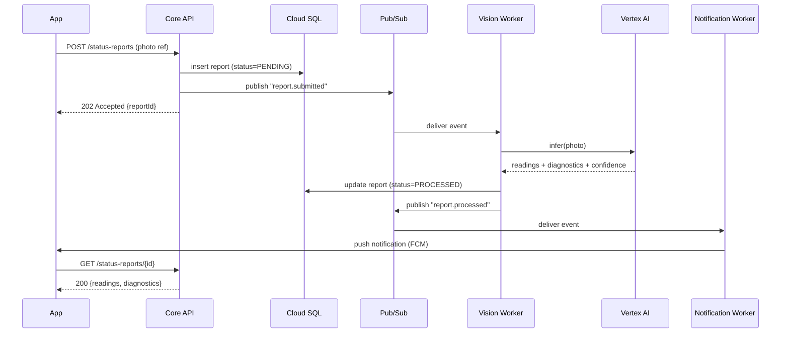
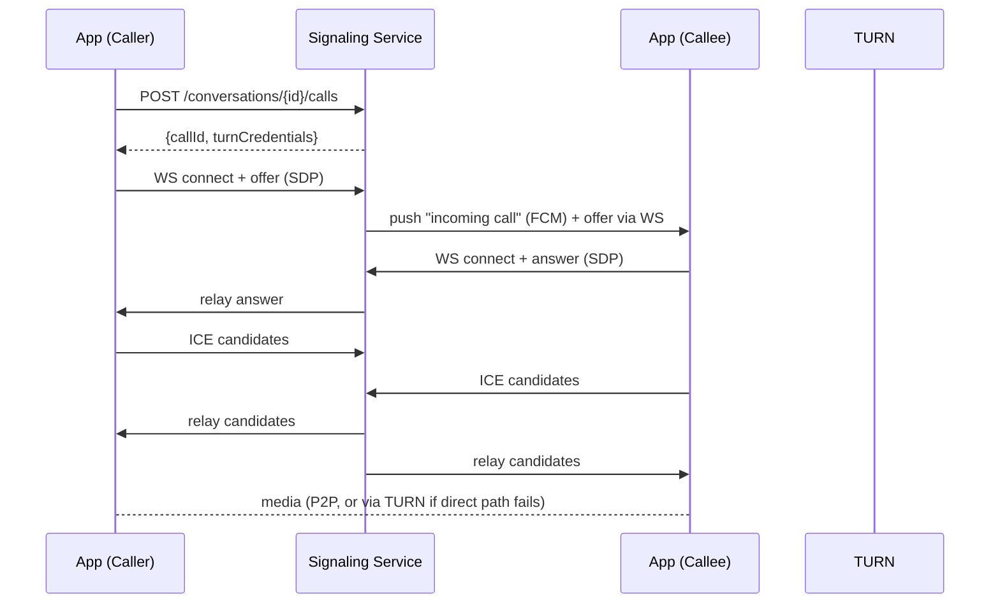

# Corvid Echo — Low-Level Design

**Status:** Draft v0.1 — for review
**Companion to:** `HLD.md`

---

## 1. Module / Package Structure (Spring Boot, modular monolith)

```
com.corvid.echo
├── identity/        # users, roles, auth
│   ├── api/         # REST controllers
│   ├── domain/       # entities, value objects
│   ├── service/
│   └── repository/
├── device/           # device registry, status reports
├── messenger/        # conversations, messages, attachments
├── calling/          # WebRTC signaling, call sessions
├── media/            # Drive adapter (used by messenger + device)
├── vision/           # async worker module (separate deployable)
├── notification/      # async worker module (separate deployable)
└── platform/         # cross-cutting: security, logging, tracing, error handling, config
```

Each bounded-context package only depends on `platform` and its own repository — no cross-context repository access. Cross-context calls go through a package-local service interface, so any module can be lifted into its own deployable later without touching callers beyond a network adapter swap.

---

## 2. Database Schema (PostgreSQL)

```sql
CREATE TABLE users (
    id              UUID PRIMARY KEY DEFAULT gen_random_uuid(),
    email           VARCHAR(255) NOT NULL UNIQUE,
    display_name    VARCHAR(120) NOT NULL,
    role            VARCHAR(20)  NOT NULL CHECK (role IN ('END_USER','SUPPORT_AGENT','ADMIN')),
    status          VARCHAR(20)  NOT NULL DEFAULT 'ACTIVE' CHECK (status IN ('ACTIVE','SUSPENDED','DELETED')),
    identity_provider_sub VARCHAR(255) NOT NULL UNIQUE,  -- Identity Platform subject
    created_at      TIMESTAMPTZ NOT NULL DEFAULT now(),
    updated_at      TIMESTAMPTZ NOT NULL DEFAULT now()
);

CREATE TABLE devices (
    id              UUID PRIMARY KEY DEFAULT gen_random_uuid(),
    owner_user_id   UUID NOT NULL REFERENCES users(id),
    device_code     VARCHAR(64) NOT NULL,   -- matches "ID:" on LCD
    label           VARCHAR(120),
    created_at      TIMESTAMPTZ NOT NULL DEFAULT now(),
    UNIQUE (owner_user_id, device_code)
);

CREATE TABLE device_status_reports (
    id              UUID PRIMARY KEY DEFAULT gen_random_uuid(),
    device_id       UUID NOT NULL REFERENCES devices(id),
    submitted_by    UUID NOT NULL REFERENCES users(id),
    photo_media_id  UUID NOT NULL REFERENCES media_objects(id),
    status          VARCHAR(20) NOT NULL DEFAULT 'PENDING' CHECK (status IN ('PENDING','PROCESSED','FAILED')),
    readings        JSONB,          -- e.g. {"L": 1560.82, "T": 24.31, "P": 12.67, "units": {...}}
    diagnostics     JSONB,          -- e.g. {"sim_present": true, "signal": "GOOD", "power_source": "MAIN"}
    ocr_confidence  NUMERIC(4,3),
    error_reason    TEXT,
    created_at      TIMESTAMPTZ NOT NULL DEFAULT now(),
    processed_at    TIMESTAMPTZ
);
CREATE INDEX idx_dsr_device_created ON device_status_reports(device_id, created_at DESC);
CREATE INDEX idx_dsr_status ON device_status_reports(status) WHERE status <> 'PROCESSED';

CREATE TABLE media_objects (
    id              UUID PRIMARY KEY DEFAULT gen_random_uuid(),
    storage_backend VARCHAR(20) NOT NULL DEFAULT 'GCS' CHECK (storage_backend IN ('GCS','DRIVE')),
    storage_ref     TEXT NOT NULL,         -- GCS object path or Drive file ID
    mime_type       VARCHAR(100) NOT NULL,
    size_bytes      BIGINT NOT NULL,
    checksum_sha256 VARCHAR(64) NOT NULL,
    uploaded_by     UUID NOT NULL REFERENCES users(id),
    scan_status     VARCHAR(20) NOT NULL DEFAULT 'PENDING' CHECK (scan_status IN ('PENDING','CLEAN','INFECTED')),
    created_at      TIMESTAMPTZ NOT NULL DEFAULT now()
);

CREATE TABLE conversations (
    id              UUID PRIMARY KEY DEFAULT gen_random_uuid(),
    type            VARCHAR(10) NOT NULL CHECK (type IN ('DIRECT','GROUP')),
    title           VARCHAR(120),
    created_by      UUID NOT NULL REFERENCES users(id),
    created_at      TIMESTAMPTZ NOT NULL DEFAULT now()
);

CREATE TABLE conversation_members (
    conversation_id UUID NOT NULL REFERENCES conversations(id),
    user_id         UUID NOT NULL REFERENCES users(id),
    joined_at       TIMESTAMPTZ NOT NULL DEFAULT now(),
    last_read_at    TIMESTAMPTZ,
    PRIMARY KEY (conversation_id, user_id)
);

CREATE TABLE messages (
    id              UUID PRIMARY KEY DEFAULT gen_random_uuid(),
    conversation_id UUID NOT NULL REFERENCES conversations(id),
    sender_id       UUID NOT NULL REFERENCES users(id),
    body            TEXT,
    sent_at         TIMESTAMPTZ NOT NULL DEFAULT now(),
    edited_at       TIMESTAMPTZ,
    deleted_at      TIMESTAMPTZ
);
CREATE INDEX idx_messages_conv_sent ON messages(conversation_id, sent_at DESC);

CREATE TABLE message_attachments (
    message_id      UUID NOT NULL REFERENCES messages(id),
    media_id        UUID NOT NULL REFERENCES media_objects(id),
    PRIMARY KEY (message_id, media_id)
);

CREATE TABLE call_sessions (
    id              UUID PRIMARY KEY DEFAULT gen_random_uuid(),
    conversation_id UUID NOT NULL REFERENCES conversations(id),
    initiated_by    UUID NOT NULL REFERENCES users(id),
    media_type      VARCHAR(10) NOT NULL CHECK (media_type IN ('AUDIO','VIDEO')),
    status          VARCHAR(20) NOT NULL DEFAULT 'RINGING' CHECK (status IN ('RINGING','ACTIVE','ENDED','FAILED','MISSED')),
    started_at      TIMESTAMPTZ NOT NULL DEFAULT now(),
    ended_at        TIMESTAMPTZ,
    end_reason      VARCHAR(40)
);

CREATE TABLE call_participants (
    call_session_id UUID NOT NULL REFERENCES call_sessions(id),
    user_id         UUID NOT NULL REFERENCES users(id),
    joined_at       TIMESTAMPTZ,
    left_at         TIMESTAMPTZ,
    PRIMARY KEY (call_session_id, user_id)
);

CREATE TABLE audit_log (
    id              BIGSERIAL PRIMARY KEY,
    actor_user_id   UUID REFERENCES users(id),
    action          VARCHAR(80) NOT NULL,
    target_type     VARCHAR(40),
    target_id       UUID,
    metadata        JSONB,
    request_id      VARCHAR(64),
    created_at      TIMESTAMPTZ NOT NULL DEFAULT now()
);
```

Migrations are managed via **Flyway**, one versioned file per change, no manual DDL against any environment.

---

## 3. REST API Contracts (representative — full OpenAPI spec to follow in repo as `openapi.yaml`)

| Method | Path | Auth | Description |
|---|---|---|---|
| POST | `/v1/auth/exchange` | Identity Platform ID token | Exchange IdP token for Echo access/refresh token pair |
| GET/POST/PUT/DELETE | `/v1/users`, `/v1/users/{id}` | Bearer (RBAC) | User CRUD |
| GET/POST | `/v1/devices`, `/v1/devices/{id}` | Bearer | Device registry CRUD |
| POST | `/v1/devices/{id}/status-reports` | Bearer | Submit photo + create PENDING report (multipart or pre-signed upload + reference) |
| GET | `/v1/devices/{id}/status-reports` | Bearer | Paginated report history |
| GET | `/v1/devices/{id}/status-reports/{reportId}` | Bearer | Single report detail (poll until `PROCESSED`) |
| POST | `/v1/conversations` | Bearer | Create direct or group conversation |
| POST | `/v1/conversations/{id}/messages` | Bearer | Send message (text + optional attachment refs) |
| GET | `/v1/conversations/{id}/messages` | Bearer | Paginated message history (cursor-based) |
| POST | `/v1/media/upload-url` | Bearer | Request a signed upload slot (GCS) before attaching media |
| POST | `/v1/conversations/{id}/calls` | Bearer | Initiate a call session, returns signaling endpoint + TURN credentials |
| WS | `/v1/signaling` | Bearer (token in handshake) | WebSocket for SDP offer/answer + ICE candidate exchange |

All error responses follow RFC 9457 Problem Details:

```json
{
  "type": "https://errors.corvidecho.com/rate-limited",
  "title": "Too Many Requests",
  "status": 429,
  "detail": "Upload rate limit exceeded for this account.",
  "instance": "/v1/devices/.../status-reports",
  "requestId": "a1b2c3d4-..."
}
```

---

## 4. Sequence Diagrams

### 4.1 Device status report submission



### 4.2 WebRTC call setup



---

## 5. Security Implementation Detail

**JWT claims:**
```json
{
  "sub": "<user-id>",
  "role": "SUPPORT_AGENT",
  "iat": 1234567890,
  "exp": 1234571490,
  "scope": "echo:api"
}
```
Access token TTL: 15 minutes. Refresh token TTL: 14 days, rotated on use, revocable server-side (stored hashed in `refresh_tokens` table, not shown above for brevity).

**RBAC matrix (representative):**

| Action | END_USER | SUPPORT_AGENT | ADMIN |
|---|---|---|---|
| View own devices/reports | ✅ | ✅ | ✅ |
| View any user's devices/reports | ❌ | ✅ | ✅ |
| Create/edit users | ❌ | ❌ | ✅ |
| Initiate call | ✅ | ✅ | ✅ |
| View audit log | ❌ | ❌ | ✅ |

---

## 6. Resilience Configuration (Resilience4j — representative values)

| Dependency | Timeout | Retry | Circuit breaker |
|---|---|---|---|
| Vertex AI (Vision Worker) | 8s | 3 attempts, exponential backoff (200ms base) + jitter | Open after 50% failure over 20 calls; half-open probe after 30s |
| Google Drive API | 5s | 3 attempts, backoff | Open after 50% failure over 20 calls |
| Pub/Sub publish | 3s | 5 attempts | N/A (client library handles) |
| Cloud SQL (via HikariCP) | connection timeout 3s | N/A | Pool sized per Cloud Run instance: max 10 |

Dead-letter topics configured on all Pub/Sub subscriptions (max 5 delivery attempts before DLQ); an alert fires on any DLQ depth > 0.

---

## 7. Observability Implementation Detail

**Log line example:**
```json
{
  "timestamp": "2026-06-26T10:15:32.451Z",
  "level": "INFO",
  "service": "echo-core-api",
  "trace_id": "4bf92f3577b34da6a3ce929d0e0e4736",
  "span_id": "00f067aa0ba902b7",
  "request_id": "a1b2c3d4-...",
  "user_id": "us3r-...",
  "message": "Status report created",
  "report_id": "rpt-..."
}
```

**Key metrics (non-exhaustive):**

| Metric | Type | Notes |
|---|---|---|
| `http.server.requests` | Counter/timer | Tagged by route, status, method (RED) |
| `vision.report.processing.duration` | Histogram | p50/p95/p99 |
| `vision.report.confidence` | Histogram | Detect model drift |
| `call.setup.success.rate` | Gauge | (successful / attempted) per hour |
| `pubsub.dlq.depth` | Gauge | Per topic |
| `db.connection.pool.active` | Gauge | Per service |

**Alert policy examples:** error rate > 1% over 5 min (page); p99 latency > 1s over 10 min (page); DLQ depth > 0 for 5 min (page); Cloud SQL failover event (page); OCR confidence median drop > 15% week-over-week (ticket, not page — quality signal, not an outage).

---

## 8. Deployment & Infra

- **Environments:** `dev`, `staging`, `prod` — separate GCP projects, isolated by IAM and VPC.
- **CI/CD pipeline stages:** lint/static analysis → unit tests → build container → Testcontainers integration tests → push to Artifact Registry → deploy to `staging` → smoke tests → manual approval gate → canary deploy to `prod` (10% → 50% → 100% traffic shift) → post-deploy health check.
- **Cloud Run config (representative):** Core API — min 2 / max 20 instances, concurrency 80, 1 vCPU / 1GiB; Signaling — min 2 / max 10 instances, concurrency lower (~20, WS connections are stateful per instance); Vision Worker — min 0 / max 10 (event-driven, scales with queue depth).
- **IaC:** Terraform modules per environment, state in a GCS backend with locking.

---

## 9. Testing Strategy

| Layer | Tooling | Notes |
|---|---|---|
| Unit | JUnit 5, Mockito | Per-module, no Spring context |
| Integration | Spring Boot Test + Testcontainers (real Postgres) | Per bounded context |
| Contract | OpenAPI-driven contract tests | Guards the mobile/backend boundary |
| Load | k6 or Gatling | Targets: status-report submission burst, call-setup concurrency |
| Resilience/chaos | Manual fault injection (kill a Cloud SQL standby, throttle Vertex AI) | Validates §6 of HLD before go-live |

---

## 10. Open Items (carried from HLD §10)

- Confirm Drive-only vs. GCS-primary/Drive-mirror media strategy.
- Vision/OCR prototyping spike needed before locking the model choice and confidence thresholds.
- Pending design principles doc — may change module structure, naming, or tooling choices above.
- SLO/DR numbers in §6/§7 of HLD are proposed defaults, not yet signed off.
