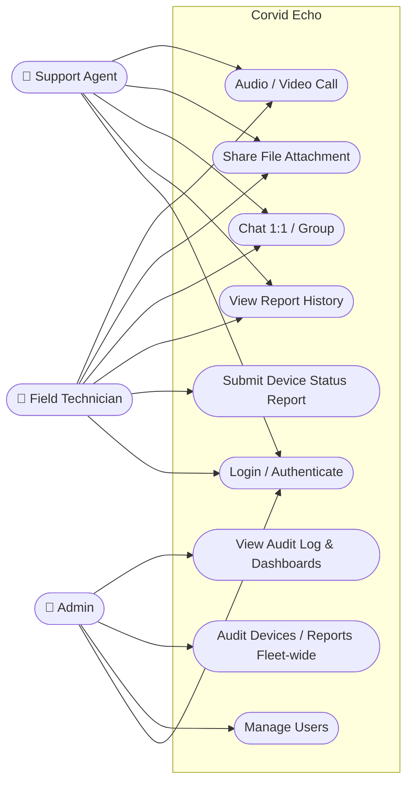
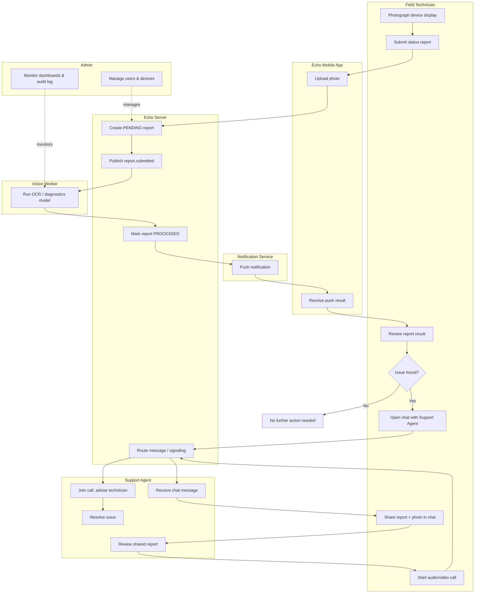

# Corvid Echo — Use Cases & Actor Workflow

**Status:** Draft v0.1 — for review
**Companion to:** `HLD.md`, `LLD.md`

---

## 1. Actors

| Actor | Description |
|---|---|
| **Field Technician** | (formerly "End User") Front-line user operating the Echo Mobile App in the field — scans devices, reports status, chats and calls Support Agents. |
| **Support Agent** | Corvid support staff who responds to technicians via chat/call and reviews device status reports. |
| **Admin** | Manages user accounts, devices, and oversees system health/audit logs. |

> Role enum used in the system: `FIELD_TECHNICIAN`, `SUPPORT_AGENT`, `ADMIN` (see `LLD.md` §2, §5).

---

## 2. Use-Case Diagram

---

## 3. Use Cases

### 3.1 Identity & Access

**UC-ID-01 — Authenticate**
- **As a** Field Technician, **I want to** log in using my company credentials, **so that** I can securely access the app.
- *Preconditions:* Account exists and is `ACTIVE`.
- *Basic flow:* App collects credentials → Identity Platform validates → Echo issues access/refresh token pair.
- *Acceptance criteria:* Invalid credentials are rejected with no information leak about which field was wrong; successful login returns a token within 1s p95.

**UC-ID-02 — Provision a user**
- **As an** Admin, **I want to** create a user account and assign a role, **so that** a new employee gets appropriate access immediately.
- *Acceptance criteria:* New account is created in `ACTIVE` status with exactly one role; action is recorded in the audit log.

**UC-ID-03 — Deactivate a user**
- **As an** Admin, **I want to** deactivate a user account, **so that** a former employee loses access immediately.
- *Acceptance criteria:* All existing refresh tokens for the user are revoked within the same request; subsequent logins fail.

**UC-ID-04 — Update my profile**
- **As a** Field Technician, **I want to** update my display name and contact info, **so that** my details stay current.

---

### 3.2 Device & Vision

**UC-DV-01 — Register a device**
- **As a** Field Technician, **I want to** register a new device under my account, **so that** I can begin submitting status reports for it.

**UC-DV-02 — Submit a status report**
- **As a** Field Technician, **I want to** photograph a device's display and submit it, **so that** the system extracts readings and diagnostics automatically instead of me transcribing them by hand.
- *Basic flow:* Capture photo → upload → server creates `PENDING` report → Vision Worker extracts readings/diagnostics → report becomes `PROCESSED`.
- *Acceptance criteria:* Submission is accepted in under 2s even if processing takes longer (async); a failed extraction sets `FAILED` with a human-readable reason, not a silent drop.

**UC-DV-03 — Get notified when a report is ready**
- **As a** Field Technician, **I want to** be notified when my submitted report finishes processing, **so that** I don't have to keep checking the app.

**UC-DV-04 — View report history**
- **As a** Field Technician, **I want to** view the history of status reports for a device, **so that** I can track its condition over time.

**UC-DV-05 — Resubmit a failed report**
- **As a** Field Technician, **I want to** resubmit a report if processing failed, **so that** a transient error (e.g. a model timeout) doesn't permanently block me.

**UC-DV-06 — Review a technician's reports remotely**
- **As a** Support Agent, **I want to** view a technician's devices and report history, **so that** I can diagnose an issue before or during a call.

**UC-DV-07 — Audit fleet-wide device health**
- **As an** Admin, **I want to** view devices and status reports across all technicians, **so that** I can audit fleet health and spot systemic issues.

---

### 3.3 Messenger

**UC-MS-01 — Start a direct chat**
- **As a** Field Technician, **I want to** start a direct chat with a Support Agent, **so that** I can ask for help on a specific issue.

**UC-MS-02 — Create a group conversation**
- **As a** Field Technician, **I want to** create a group conversation, **so that** I can loop in multiple agents or teammates on a shared issue.

**UC-MS-03 — Share a file attachment**
- **As a** Field Technician, **I want to** attach photos, videos, or documents to a message, **so that** I can give the agent more context than text alone.
- *Acceptance criteria:* Upload is virus-scanned before becoming visible to other participants (see `HLD.md` §7).

**UC-MS-04 — See delivery/read status**
- **As a** Support Agent, **I want to** see delivery and read receipts on my messages, **so that** I know whether the technician has seen my response.

**UC-MS-05 — Get notified of new messages**
- **As a** Field Technician, **I want to** receive a push notification for new messages, **so that** I respond promptly even when the app is backgrounded.

---

### 3.4 Calling

**UC-CL-01 — Start a call from a chat**
- **As a** Field Technician, **I want to** start an audio or video call from within a chat, **so that** I can get real-time help on an urgent issue.

**UC-CL-02 — Receive an incoming call alert**
- **As a** Support Agent, **I want to** receive an incoming call alert even if the app is backgrounded, **so that** I don't miss urgent requests.

**UC-CL-03 — Know the outcome of a call**
- **As a** Field Technician or Support Agent, **I want to** see a clear call status (missed / failed / ended), **so that** I know whether to retry or follow up another way.

---

### 3.5 Administration & Oversight

**UC-AD-01 — Review the audit log**
- **As an** Admin, **I want to** view an audit log of sensitive actions (user/device changes, role changes), **so that** I can investigate incidents.

**UC-AD-02 — Monitor system health**
- **As an** Admin, **I want to** view observability dashboards (error rates, latency, OCR confidence trends), **so that** I can spot issues before users report them.

---

## 4. Actor Workflow Diagram (End-to-End)

This traces the most common real-world path: a technician finds a problem via a status report, escalates to chat, and if needed, escalates further to a live call — while Admin oversight runs in parallel.

**Reading the diagram:** the top path (Technician → App → Server → Vision Worker → Notification → back to Technician) is the automated status-report pipeline from `HLD.md` §3.4. If the technician judges the result to be a real issue, the flow escalates to Messenger, and from there optionally to a Call — both routed through the same Echo Server signaling/messaging path. Admin activity (user/device management, dashboard and audit-log monitoring) runs continuously alongside, not as a step in this particular path.

---

## 5. Open Items

- Confirm whether "Issue found?" triage (UC flow §4) is a manual technician judgment call (as modeled) or should be partly automated (e.g. system auto-flags out-of-range readings and suggests escalation).
- Confirm Admin-facing use cases (UC-AD-01/02) — do agents also need read access to dashboards, or is that Admin-only as modeled?
